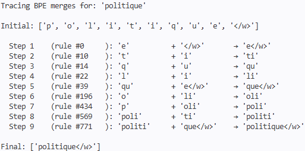

# BPE & WordPiece Tokenization

Implementation of BPE and WordPiece tokenization algorithms from scratch in Python, with naive and fast versions. Trained on French Wikipedia (180k articles), evaluated on training and encoding time, compression metrics and morphological analysis

## Requirements
Only requires Pixi, which handles all dependencies for Linux and macOS.
- [Pixi](https://pixi.sh)

## Installation

```bash
curl -fsSL https://pixi.sh/install.sh | bash
git clone https://github.com/axmeu/BPE_WP_project.git
cd BPE_WP_project
pixi install
```

- To use the Pixi environment as a Jupyter kernel:

```bash
pixi run python -m ipykernel install --user --name pixi-env --display-name "pixi-env"
```

Then select `pixi-env` as the kernel in Jupyter.

## Usage

**Full pipeline:**

The experimental protocol is managed by Snakemake and is fully reproducible, from training the naive algorithms and visualizing their time complexity to training and evaluating the two fast algorithms on three vocabulary sizes (20k, 32k, and 50k) on the full dataset.
- To run the full pipeline, set `--cores` according to the available memory:
```bash
pixi run snakemake --cores 4
```

**Train a specific tokenizer:**

Get the full command list with:
```bash
pixi run python src/train.py --help
```
Example:
```bash
pixi run python src/train.py --tokenizer bpe_fast --vocab-size 20000 --n_train 180000 --min_frequency 10
```


**Evaluate:**
- Train & Encoding time
- Vocabulary compression metrics
- Morphological analysis

Get the full command list with:
```bash
pixi run python src/evaluate.py --help
```
Example:
```bash
pixi run python src/evaluate.py --tokenizers bpe_fast,wp_fast --vocab-size 20000 --n-train 10000 --n-test 1000
```

**Quick demo:**

Get the full command list with:
```bash
pixi run python src/demo.py --help
```
- Tokenize the given sentence:
```bash
pixi run python src/demo.py --tokenizer bpe_fast --vocab_size 20000 --n_train 180000 tokenize --text "Ceci est une démonstration de notre tokenizer"
```
- Trace BPE rules for a single given word:
```bash
pixi run python src/demo.py --tokenizer bpe_fast --vocab_size 20000 --n_train 180000 trace --word "politique"
```



## HuggingFace Datasets

- **French Wikipedia**: `axmeu/wiki_fr` 

  Derived from the Hugging Face dataset `wikimedia/wikipedia` (version *20231101.fr*), processed for tokenizer training and testing.

- **Morphological benchmark**: `axmeu/morphscore_fr`

  Based on MorphScore (Arnett et al., 2025) ([GitHub repository](https://github.com/catherinearnett/morphscore)).
